# Pipeline CI/CD (Jenkins)
##### Master IASD 2023-2025 (BIDAR Anas,BOUZIANI Ali)


---
.
.
.
.


#  1 - l'Installation des Outils

Installer les outils Git, Docker, Maven et Jenkins pour un pipeline CI/CD sur un système Ubuntu.

## Installation de Git
- **Git** permet de gérer les versions du code source.
- Commande :
  ```bash
  sudo apt update && sudo apt install git -y
  ```
  - `sudo apt update`: Met à jour la liste des paquets disponibles.
  - `sudo apt install git -y`: Installe Git automatiquement sans demander de confirmation.

## Installation de Docker
- **Docker** crée des conteneurs pour isoler et déployer les applications.
- Étapes principales :
  ```bash
  sudo apt install apt-transport-https ca-certificates curl software-properties-common -y
  ```
  - Installe les paquets requis pour télécharger et gérer des dépôts sécurisés.

  ```bash
  curl -fsSL https://download.docker.com/linux/ubuntu/gpg | sudo apt-key add -
  ```
  - Télécharge et ajoute la clé GPG de Docker pour des mises à jour sécurisées.

  ```bash
  sudo add-apt-repository "deb [arch=amd64] https://download.docker.com/linux/ubuntu $(lsb_release -cs) stable"
  ```
  - Ajoute le dépôt Docker à la liste des sources de paquets pour Ubuntu.

  ```bash
  sudo apt update && sudo apt install docker-ce -y
  ```
  - Met à jour la liste des paquets et installe Docker.

  ```bash
  sudo systemctl start docker && sudo systemctl enable docker
  ```
  - Démarre Docker et configure son démarrage automatique.

- **Optionnel** : Ajoutez l’utilisateur actuel au groupe `docker` :
  ```bash
  sudo usermod -aG docker $USER
  ```
  - Permet à l'utilisateur d'exécuter Docker sans commandes sudo.


## Installation de Jenkins
- **Jenkins** orchestre le pipeline CI/CD, en automatisant les étapes de build, test et déploiement.
- Étapes principales :
  ```bash
  sudo apt update && sudo apt install openjdk-11-jdk -y
  ```
  - Installe Java, requis pour Jenkins.

  ```bash
  wget -q -O - https://pkg.jenkins.io/debian/jenkins.io.key | sudo apt-key add -
  ```
  - Télécharge et ajoute la clé GPG de Jenkins.

  ```bash
  echo deb http://pkg.jenkins.io/debian-stable binary/ | sudo tee /etc/apt/sources.list.d/jenkins.list
  ```
  - Ajoute le dépôt Jenkins.

  ```bash
  sudo apt update && sudo apt install jenkins -y
  ```
  - Met à jour les paquets et installe Jenkins.

  ```bash
  sudo systemctl start jenkins && sudo systemctl enable jenkins
  ```
  - Démarre Jenkins et configure son démarrage automatique.

  - Accéder à Jenkins : `http://localhost:8080`
  - Récupérez le mot de passe initial :
    ```bash
    sudo cat /var/lib/jenkins/secrets/initialAdminPassword
    ```
    - Affiche le mot de passe pour la configuration initiale de Jenkins.
    - 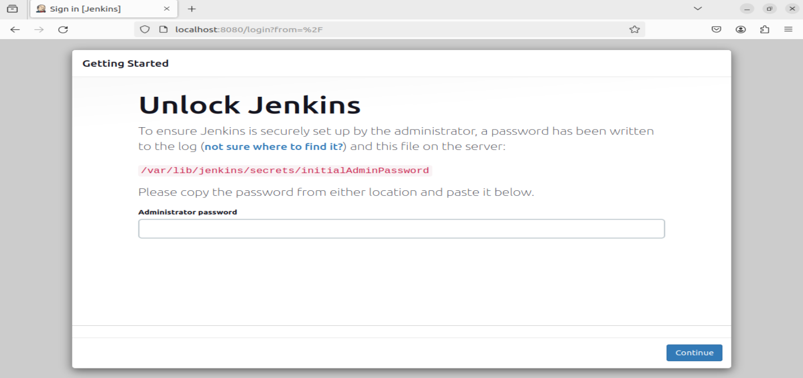


---
-
-
-
-
-
-
-
-
-

# 2 - Page d'accueil de Jenkins

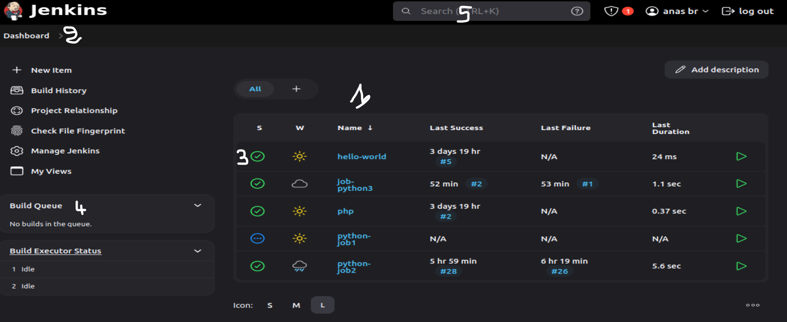
Les éléments principaux de la page d'accueil :

1. **Tableau de bord** : Liste de tous les projets (ou jobs) avec leur état actuel (réussite, échec, en cours).

2. **Barre de navigation** : Permet d'accéder aux options clés comme la création de nouveaux jobs, la gestion des utilisateurs, l'historique des builds, et les paramètres.

3. **Icônes de statut** : Chaque job est associé à une couleur d'icône indiquant son état :
   - **Bleu/Vert** : Réussi
   - **Rouge** : Échec
   - **Jaune** : Instable
   - **Gris** : En attente

4. **Builds récents** : Aperçu rapide des dernières exécutions de chaque job pour surveiller l’état de vos projets.

5. **Recherche rapide** : Barre de recherche pour retrouver des jobs ou autres éléments dans Jenkins.

Ces éléments rendent la page d’accueil de Jenkins intuitive et permettent une surveillance et une gestion rapides des projets.
-
-
-
-
-
-
-
-
-
# 3 - Types de Projets Jenkins 
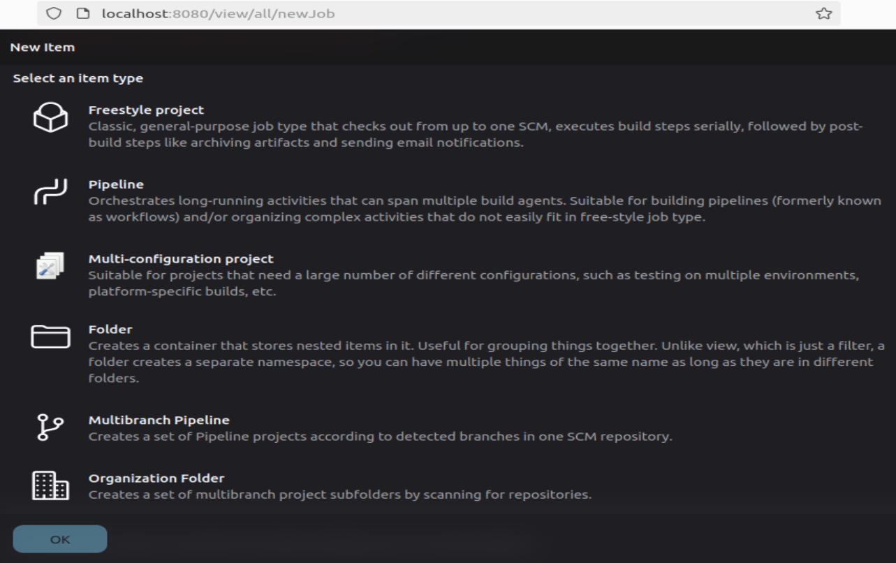

1. **Projet Freestyle** : Permet de configurer des étapes de build simples et flexibles via des scripts Shell, Batch, ou PowerShell.

2. **Pipeline** : Utilise un DSL (Domain-Specific Language) Groovy pour définir des workflows CI/CD complexes et automatisés.

3. **Projet Multi-Configuration** : Exécute des builds sur plusieurs configurations pour tester différentes combinaisons d'environnements.

5. **Dossier** : Organise les jobs de Jenkins en conteneurs pour un environnement structuré.

7. **Pipeline Multi-Branches** : Crée un pipeline distinct pour chaque branche d’un dépôt, permettant des tests indépendants par branche.
   
8. **Projet d'Organisation GitHub** : Automatise la création de jobs pour les dépôts GitHub d’une organisation ou d’un compte utilisateur.
 
-
-
-
-
-
-
-
-
-

# 4 -  Création des Pipelines 


##  Pipeline avec "pipeline script"

Dans cette configuration, nous allons définir le pipeline directement dans l'interface Jenkins sans utiliser de dépôt Git.

### Étapes

1. **Créer un Projet Pipeline dans Jenkins** :
   - Dans Jenkins, cliquez sur **New Item**.
   - Donnez un nom au projet, sélectionnez **Pipeline**, puis cliquez sur **OK**.

2. **Configurer le Pipeline** :
   - Dans la section **Pipeline**, sélectionnez **Pipeline script**.
   - Saisissez directement le script du pipeline :

     ```groovy
     pipeline {
         agent any
         
         stages {
             stage('Build') {
                 steps {
                     echo 'Building...'
                 }
             }
             
             stage('Test') {
                 steps {
                     echo 'Running tests...'
                 }
             }
             
             stage('Deploy') {
                 steps {
                     echo 'Deploying...'
                 }
             }
         }
     }
     ```

3. **Enregistrer et Exécuter le Pipeline** :
   - Cliquez sur **Save** pour enregistrer la configuration.
   - Cliquez sur **Build Now** dans le tableau de bord pour exécuter le pipeline.


---
-
-
-
-
-
-
-
-
-


# 5 -  Configuration des Pipelines Jenkins

## Configuration Générale

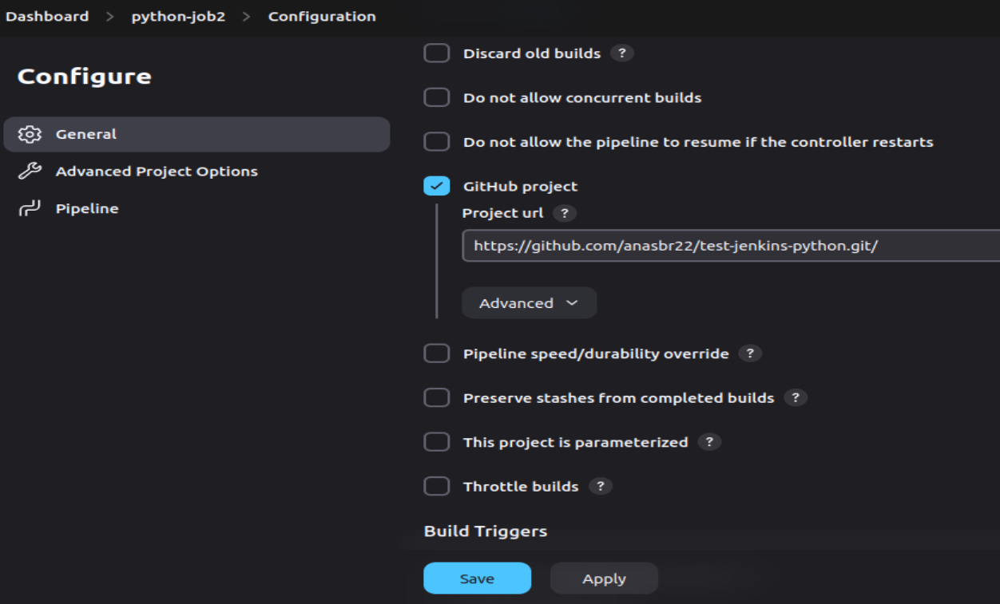

1. **Discard old builds** (Écarter les anciens builds) : Limite le stockage des builds anciens pour éviter la saturation de l'espace disque.

2. **Do not allow concurrent builds** (Ne pas autoriser les builds simultanés) : Empêche l'exécution simultanée de plusieurs builds pour ce projet.

3. **Do not allow the pipeline to resume if the controller restarts** (Ne pas autoriser le pipeline à reprendre si le contrôleur redémarre) : Évite la reprise automatique du pipeline après un redémarrage de Jenkins.

4. **GitHub project** (Projet GitHub) : Indique l'URL d'un projet GitHub associé pour faciliter l'intégration.


5. **Pipeline speed/durability override** (Remplacement de la vitesse/durabilité du pipeline) : Permet de configurer la vitesse et la durabilité du pipeline pour des performances optimales.

6. **Preserve stashes from completed builds** (Préserver les stashes des builds terminés) : Conserve les stashes des builds terminés pour une utilisation future.

7. **This project is parameterized** (Ce projet est paramétré) : Permet d'ajouter des paramètres d'entrée pour rendre le pipeline plus flexible.

8. **Throttle builds** (Limiter les builds) : Limite le nombre de builds simultanés pour gérer les ressources partagées.

## Déclencheurs

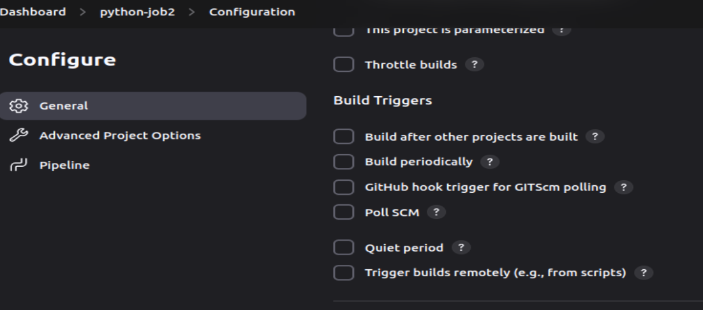

10. **Build after other projects are built** (Construire après que d'autres projets ont été construits) : Déclenche le build d’un projet après la réussite d’un ou plusieurs autres projets.

11. **Build periodically** (Construire périodiquement) : Planifie des builds à intervalles réguliers en utilisant une syntaxe Cron.

12. **GitHub hook trigger for GITScm polling** (Déclencheur de hook GitHub pour le polling GITScm) : Déclenche des builds en utilisant des hooks GitHub lorsque des modifications sont poussées.

13. **Poll SCM** (Poll SCM) : Vérifie régulièrement le dépôt pour des modifications et déclenche un build si des changements sont détectés.

14. **Quiet period** (Période de silence) : Définit un délai d'attente avant le démarrage d'un build après un déclenchement.

15. **Trigger builds remotely (e.g., from scripts)** (Déclencher des builds à distance (par exemple, à partir de scripts)) : Permet de déclencher des builds à distance via des scripts ou des API.

-
-
-
-
-
-
-
-
-
# 6 - Gestion des Utilisateurs et des Rôles dans Jenkins

## 1. Créer un Utilisateur

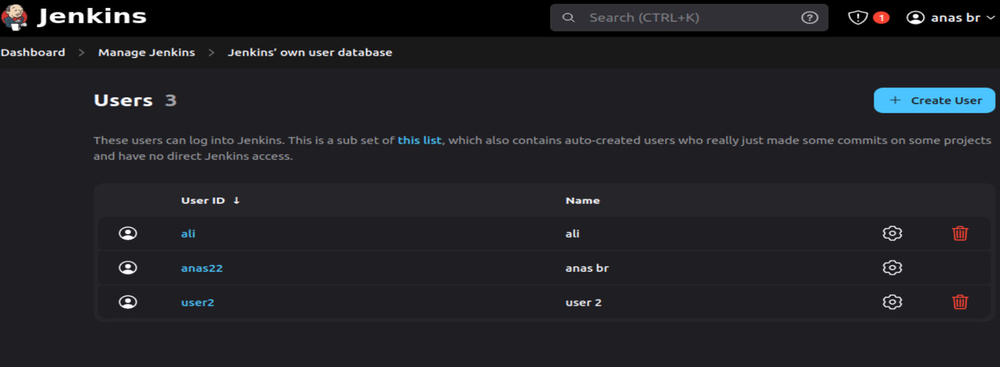

- Connectez-vous à Jenkins avec un compte administrateur.
- Allez dans **Manage Jenkins** > **Manage Users**.
- Cliquez sur **Create User**.
- Remplissez les champs requis (nom d'utilisateur, mot de passe, adresse e-mail, etc.).
- Cliquez sur **Create User** pour finaliser la création.

## 2. Essayer d'Authentifier

- Déconnectez-vous de votre compte administrateur.
- Essayez de vous connecter avec les informations d'identification du nouvel utilisateur que vous venez de créer.

## 3. Installer le Plugin Nécessaire


- Accédez à **Manage Jenkins** > **Manage Plugins**.
- Dans l'onglet **Available**, recherchez et sélectionnez le plugin **Role-Based Authorization Strategy**.
- Cliquez sur **Install without restart** pour installer le plugin.
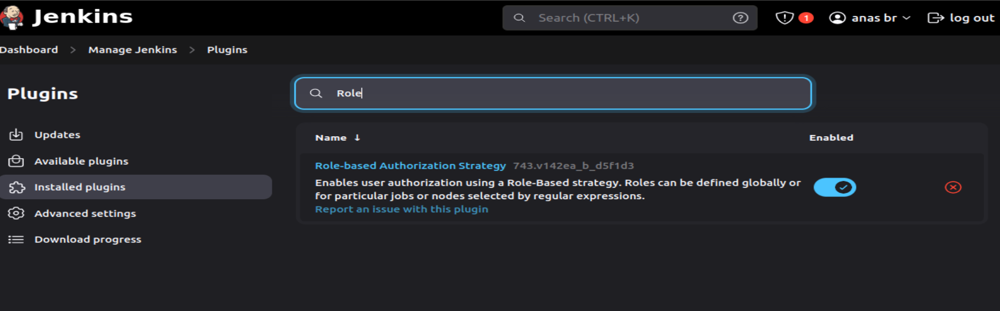
## 4. Configuration des Rôles

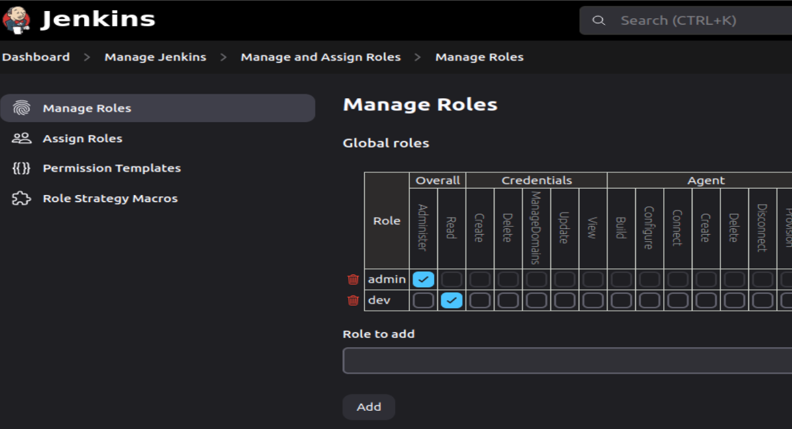

- Après l'installation, allez dans **Manage Jenkins** > **Manage and Assign Roles** > **Manage Roles**.
- Créez de nouveaux rôles en définissant les permissions souhaitées pour chaque rôle (par exemple, Admin, Developpeur, Utilisateur).
- Cliquez sur **Add Role** pour chaque rôle que vous souhaitez créer et définissez les permissions.

## 5. Assigner des Rôles aux Utilisateurs

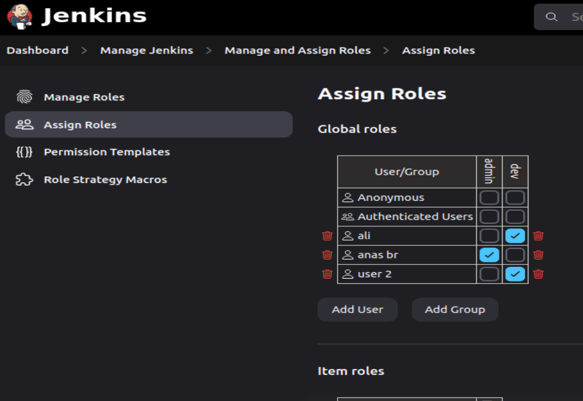

- Accédez à **Manage Jenkins** > **Manage and Assign Roles** > **Assign Roles**.
- Sélectionnez le rôle souhaité pour chaque utilisateur et cliquez sur **Save**.

## 6. Reauthentifier

- Pour tester la configuration, déconnectez-vous et reconnectez-vous en tant qu'utilisateur avec un rôle spécifique.
- Vérifiez que les permissions sont appliquées correctement en essayant d'accéder à différentes sections de Jenkins en fonction du rôle assigné.
  
-
-
-
-
-
-
-
-
-


# 7 -  Exemple-1 (repertoire exemple_1)

Dans cette configuration, nous allons utiliser un **Jenkinsfile** stocké dans le dépôt Git `https://github.com/anasbr22/test-jenkins-docker.git` (exemple_1) pour définir les étapes du pipeline. Ce fichier `Jenkinsfile` contient les étapes pour cloner le dépôt, installer les dépendances et exécuter les tests de l'application.

### Étapes

1. **Préparer le Dépôt Git** :
   - Assurez-vous que le dépôt est accessible à l'adresse suivante : `https://github.com/anasbr22/test-jenkins-docker.git`.

2. **Créer le Pipeline dans Jenkins** :
   - Dans Jenkins, cliquez sur **New Item** pour créer un nouveau projet.
   - Donnez un nom au projet, sélectionnez **Pipeline**, puis cliquez sur **OK**.
   - Allez dans **Pipeline** > **configuration** et sélectionnez **Pipeline script from SCM**.
   - Choisissez **Git** comme source et ajoutez l’URL du dépôt Git : `https://github.com/anasbr22/test-jenkins-docker.git`.
   - Entrez le nom du branche (*/main)
   - Entrez le chemin du Jenkinsfile (`exemple_1/Jenkinsfile`).
   - Cliquez sur **Save**.

3. **Exécuter le Pipeline** :
   - Cliquez sur **Build Now** dans le tableau de bord du projet.
   - Jenkins clonerait le dépôt et exécuterait les étapes définies dans le Jenkinsfile :
     - **Clone Repository** pour cloner le dépôt.
     - **Install Dependencies** pour installer les dépendances requises.
     - **Run Tests** pour exécuter les tests définis dans `test_app.py`.

---
-
-
-
-
-
-
-
-
-
#  7 -  Exemple-3 ***jenkins et docker*** (repertoire exemple_3) 


## Pré-requis
1. **Node.js** :

    - Installation de Node.js dans Jenkins


      - **Installer le Plugin Node.js dans Jenkins** :
        - Dans Jenkins, allez dans **Manage Jenkins** > **Manage Plugins**.
        - Allez dans l'onglet **Available**, recherchez "NodeJS Plugin" et installez-le.

      - **Configurer Node.js dans Jenkins** :
        - Une fois le plugin installé, allez dans **Manage Jenkins** > **Global Tool Configuration**.
        - Faites défiler jusqu'à la section **NodeJS**.
        - Cliquez sur **Add NodeJS** pour ajouter une version de Node.js.
        - Donnez un nom (par exemple, `nodejs-23`) et sélectionnez une version de Node.js appropriée dans la liste.
        - Cochez la case **Install automatically** si vous souhaitez que Jenkins télécharge et installe automatiquement Node.js.
        - 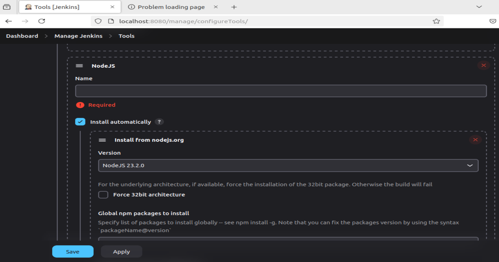

      - **Utiliser Node.js dans un Pipeline Jenkins** :
        - Dans le fichier `Jenkinsfile`, spécifiez l'outil Node.js en ajoutant le bloc suivant sous `tools` :
          ```groovy
          tools {
              nodejs 'nodejs-23'  // Nom configuré pour Node.js
          }
          ```
        - Jenkins utilisera cette version de Node.js pour exécuter les commandes `npm` dans le pipeline.


## Étapes de configuration du pipeline Jenkins

### 1. Créer un nouveau projet Pipeline
  

### 2. Configurer le pipeline avec un script SCM
  

### 3. Spécifier les détails du dépôt
   - **Repository URL** : `https://github.com/anasbr22/test-jenkins-docker.git`
   - **Branch Specifier** : `*/main`
   - **Script Path** : `exemple_3/Jenkinsfile`

### 4. Enregistrer et exécuter
   - Cliquez sur **Enregistrer** pour sauvegarder la configuration.
   - Cliquez ensuite sur **Construire maintenant** pour exécuter le pipeline.

## Contenu du fichier `Jenkinsfile`

Voici le script `Jenkinsfile` à placer dans `exemple_3/Jenkinsfile` :

```groovy
pipeline {
    agent any

    tools {
        nodejs 'nodejs-23'  // Configure Node.js dans Jenkins
    }

    environment {
        IMAGE_NAME = 'calculator-app'
        CONTAINER_NAME = 'calculator-app-container'
        PORT = '5000'
    }

    stages {
        stage('Checkout') {
            steps {
                script {
                    // Cloner le repository contenant l'application
                    git url: 'https://github.com/anasbr22/test-jenkins-docker.git', branch: 'main'
                }
            }
        }

        stage('Install Dependencies') {
            steps {
                script {
                    // Accéder au dossier 'exemple_3' et installer les dépendances
                    dir('exemple_3') {
                        sh 'npm install'
                    }
                }
            }
        }


        stage('Stop Existing Container') {
            steps {
                // Arrêter et supprimer un conteneur existant
                sh "docker stop ${CONTAINER_NAME} || true"
                sh "docker rm ${CONTAINER_NAME} || true"
            }
        }

        stage('Remove Old Docker Image') {
            steps {
                script {
                    // Supprimer l'image Docker précédente si elle existe
                    sh "docker rmi -f ${IMAGE_NAME} || true"
                }
            }
        }

        stage('Build Docker Image') {
            steps {
                script {
                    // Construire l'image Docker
                    dir('exemple_3') {
                        sh "docker build -f ./Dockerfile -t ${IMAGE_NAME} ."
                    }
                }
            }
        }

        stage('Run Docker Container') {
            steps {
                script {
                    // Lancer le conteneur Docker en mode détaché
                    sh "docker run -d --name ${CONTAINER_NAME} -p ${PORT}:${PORT} ${IMAGE_NAME}"
                    echo "Application running at http://localhost:${PORT}"
                }
            }
        }
    }

    post {
        always {
            echo "Pipeline Terminé."
            // Arrêter le conteneur
            sh "docker stop ${CONTAINER_NAME} || true"
        }
    }
}
```
### Analyse du Jenkinsfile

Ce fichier `Jenkinsfile` automatise le processus de **construction**, **test**, et **déploiement** d'une application Node.js en utilisant Docker. Voici une vue d'ensemble des étapes du pipeline :

#### Structure et Environnement

- **Agent** : `agent any` permet au pipeline de s'exécuter sur n'importe quel nœud.
- **Outils** : Utilise Node.js (`nodejs-23`) pour gérer les étapes nécessitant Node.js.
- **Variables d'environnement** :
  - `IMAGE_NAME` : Nom de l'image Docker.
  - `CONTAINER_NAME` : Nom du conteneur Docker.
  - `PORT` : Port d'accès à l'application (ici, `5000`).

#### Étapes du Pipeline

1. **Checkout** : Clone le dépôt Git pour récupérer le code source de l'application.
2. **Install Dependencies** : Installe les dépendances dans le dossier `exemple_3` avec `npm install`.
3. **Stop Existing Container** : Arrête et supprime tout conteneur existant avec le même nom.
4. **Remove Old Docker Image** : Supprime l'image Docker existante pour éviter les conflits.
5. **Build Docker Image** : Construit une nouvelle image Docker dans `exemple_3` à partir du `Dockerfile`.
6. **Run Docker Container** : Lance le conteneur sur le port 5000 et affiche l'URL d'accès.

#### Accéder à l'Application
Une fois le pipeline exécuté, accédez à l'application à l'adresse suivante :

```bash
http://localhost:5000
```


-
-
-
-
-
-
-
-
-


# 9 -  Création et Utilisation d'un Agent Jenkins

### Qu'est-ce qu'un Agent Jenkins ?

Un **agent Jenkins** ("nœud esclave") est un serveur ou une machine qui est utilisée pour exécuter des tâches dans un pipeline Jenkins. L'agent est connecté à un serveur maître Jenkins et peut exécuter des étapes de build, de test, ou de déploiement sur des environnements spécifiques, tout en permettant à Jenkins de distribuer les tâches de manière efficace.


### Types d'Agents Jenkins
1. **Agent Docker** : Utiliser Docker comme environnement d'exécution pour l'agent.
2. **Agent basé sur un système d'exploitation spécifique** : Exécuter des builds sur un serveur ou une machine virtuelle avec un OS particulier (Linux, Windows, macOS, etc.).
3. **Agent dans le Cloud** : Utiliser des services cloud comme AWS ou GCP pour provisionner dynamiquement des agents Jenkins.

### Créer un Nouveau Agent Jenkins


#### 1. Créer un Agent sur Jenkins Master
1. **Accéder à l'interface Jenkins** : Connectez-vous à votre serveur Jenkins maître.
2. **Aller dans la gestion des nœuds** : Allez dans **"Gérer Jenkins"** > **"Gérer les nœuds"** > **"Nouveau nœud"**.
   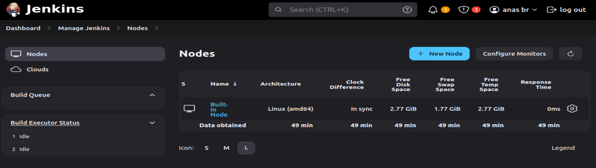
3. **Nommer le nœud** : Donnez un nom à votre agent.
4. **Choisir le type d'agent** :
    - **Permanent Agent** : Si vous voulez créer un agent permanent sur une machine spécifique.
    - **Dynamique (Cloud)** : Si vous prévoyez d'utiliser un agent basé sur le cloud (comme AWS).
5. **Configurer l'agent**

   1. **Nom** : Définissez un nom unique pour identifier l'agent.
   2. **Description** : Ajoutez une brève description de l'agent pour clarifier son utilisation ou sa configuration.
   3. **Nombre d'exécuteurs** : Indiquez combien d'exécuteurs peuvent fonctionner simultanément sur cet agent.
   4. **Répertoire racine distant** : Spécifiez l’emplacement principal où les builds seront stockés sur l'agent.
   5. **Labels** : Attribuez des labels pour identifier les tâches ou pipelines spécifiques à exécuter sur cet agent.
   6. **Usage** : Choisissez comment l'agent sera utilisé.
   7. **Méthode de lancement** : Sélectionnez le protocole de communication entre le maître et l'agent (SSH,...).
   8. **Disponibilité** : Définissez les règles de disponibilité de l’agent pour déterminer quand il sera actif.
   9. **Propriétés du nœud** : Configurez des paramètres avancés, tels que :
      - Les seuils de surveillance de l’espace disque.
      - Les variables d’environnement.
      - Les emplacements des outils si nécessaire.

    

   -  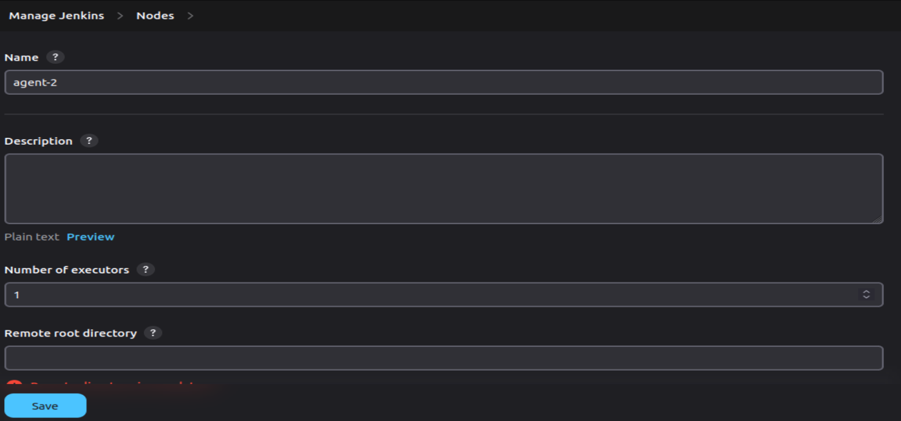

#### 2. Lancer l'Agent
- Après avoir configuré l'agent, assurez-vous que le **port TCP pour les agents** est activé dans les **paramètres de sécurité** de Jenkins.
- 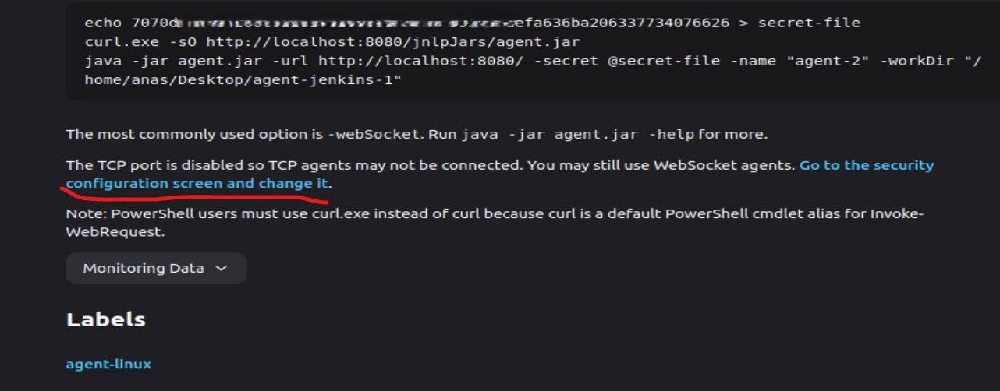
- 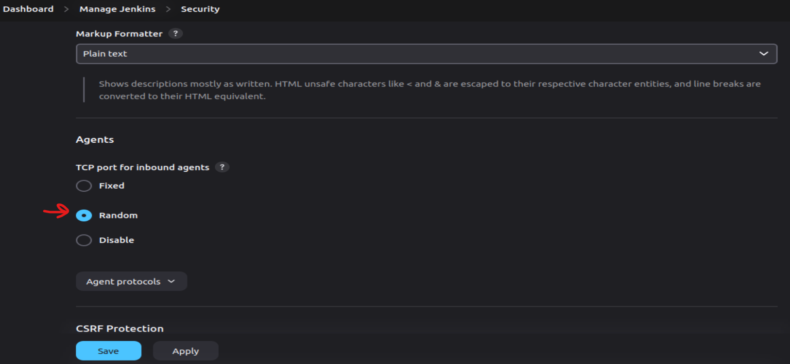
- Ensuite, exécutez les commandes affichées dans la section de configuration de l'agent pour établir la connexion.
-  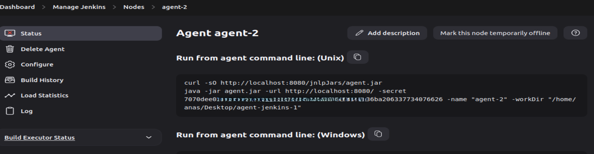
- Une fois l'agent connecté, il sera prêt à exécuter des tâches de build.


#### 3. Vérifier le Statut de l'Agent
- Vous pouvez vérifier si l'agent fonctionne correctement dans la liste des nœuds. L'agent apparaîtra comme **"en ligne"** ou **"hors ligne"** selon son état.
- 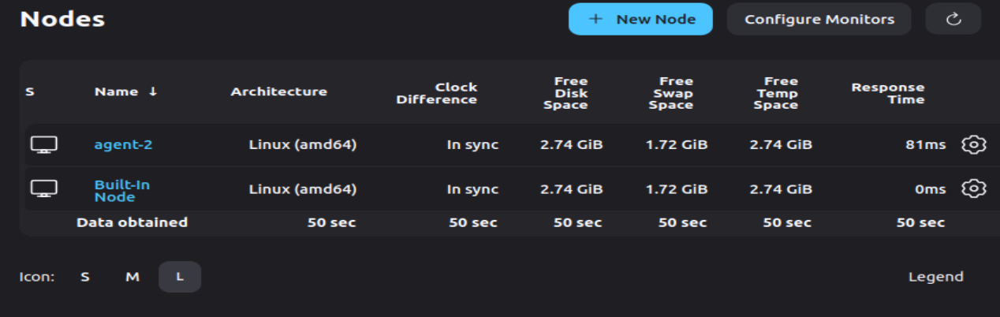

---

### Comment Utiliser un Agent Jenkins dans un Pipeline

Dans le fichier Jenkinsfile, vous pouvez spécifier quel agent utiliser pour chaque étape ou pour l'ensemble du pipeline en utilisant la directive `agent`.


#### Exemple d'utilisation d'un Agent pour un Stage :

```groovy
pipeline {
    agent any  // Utiliser n'importe quel agent pour le pipeline globalement

    stages {
        stage('Build') {
            agent { label 'build-agent' }  // Utiliser un agent spécifique 
            steps {
                echo 'Building the project...'
            }
        }

        stage('Test') {
            agent { label 'test-agent' }  // Utiliser un autre agent spécifique 
            steps {
                echo 'Running tests...'
            }
        }

        stage('Deploy') {
            agent { label 'deploy-agent' }  // Utiliser un agent spécifique pour le déploiement
            steps {
                echo 'Deploying the project...'
            }
        }
    }
}
```